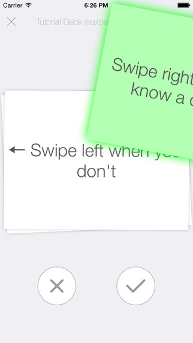
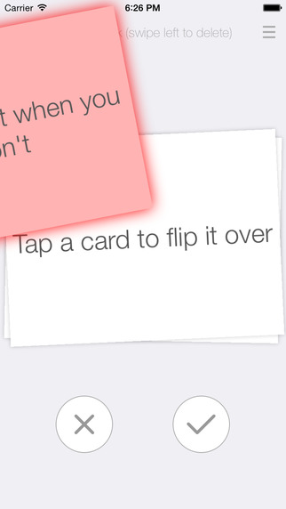
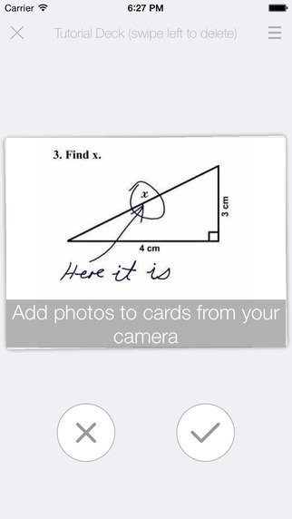
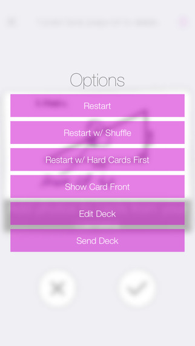
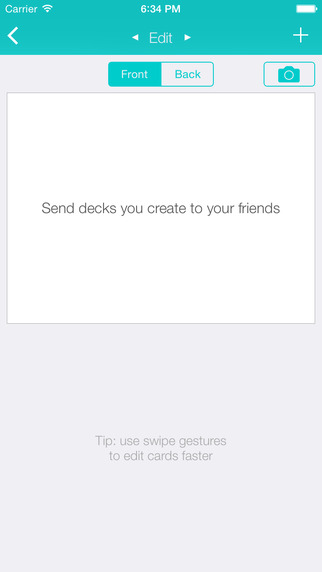

# FlipFlash

# FlipFlash
FlipFlash is a simple gesture-driven flash card app written in Objective-C in a week: https://itunes.apple.com/app/id980909860

Create your own deck and swipe left or right to track which cards you know and don’t know. Tap to flip, or pinch and rotate to look closer. Shuffle the cards, sort them by difficulty, or decide which side of the card you see first as you go through them. There’s no need for buttons, labels, or confusing checkboxes to record your learning progress. Be the hero and help your friends learn by sending your decks to them in an instant.

Features:
- Use your fingers to swipe cards left and right instead of tapping buttons to show that you know them.
- Put content on the front and back of the cards. Flip back and forth between them.
- Learn by going through the cards front-facing, back-facing, or random.
- Shuffle the cards to break repetition.
- Sort cards by difficulty so you can repeat the hard cards first.
- Take photos of your handwritten notes with your camera and place them on a card.
- Create cards automatically from your clipboard. Simply copy your notes (or a even a webpage), and FlipFlash will detect it when you create a new deck.
- Send cards to friends so they can learn from your decks.
- App changes color based on the day you open it to keep things fresh.

## License

SideMenu is available under the MIT license. See the LICENSE file for more info.
